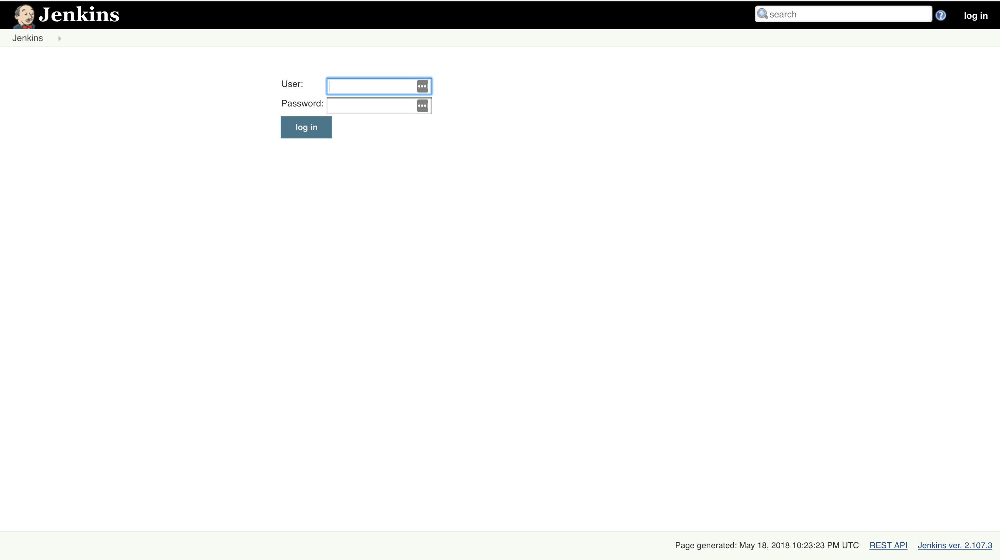
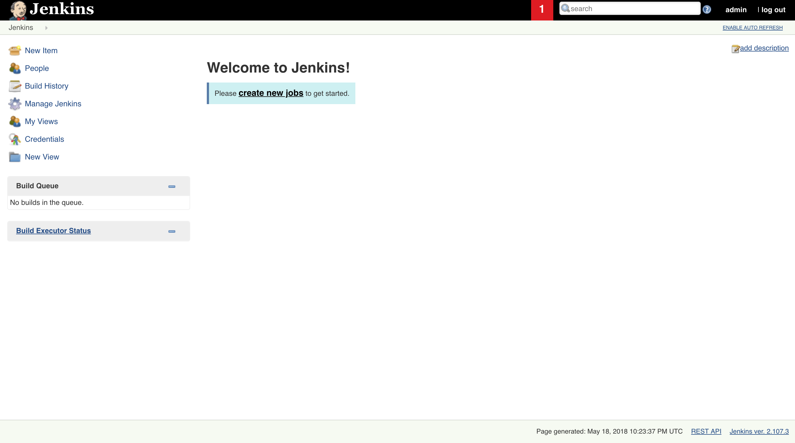
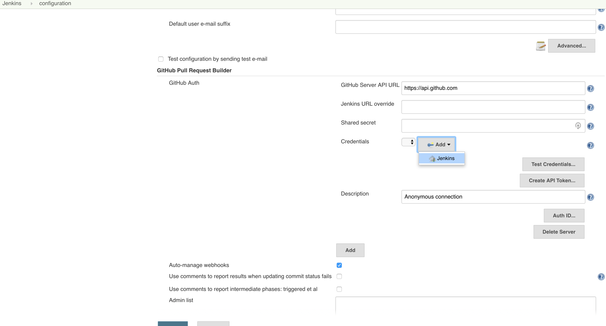
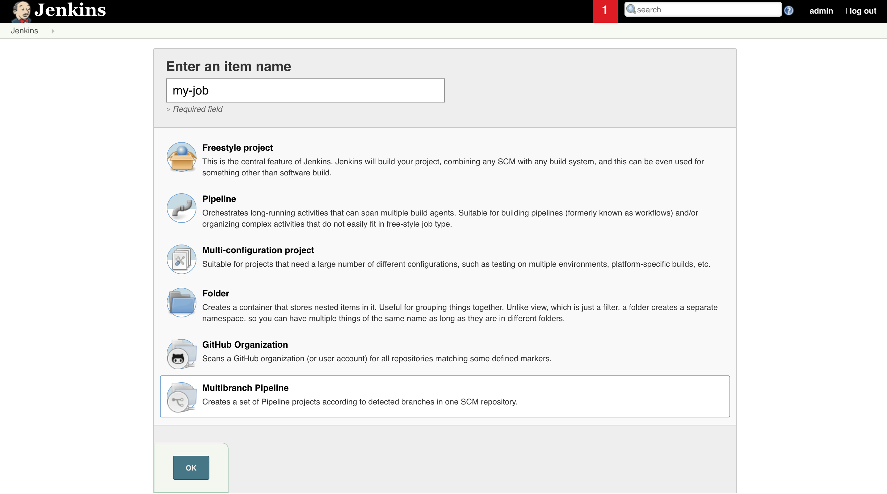
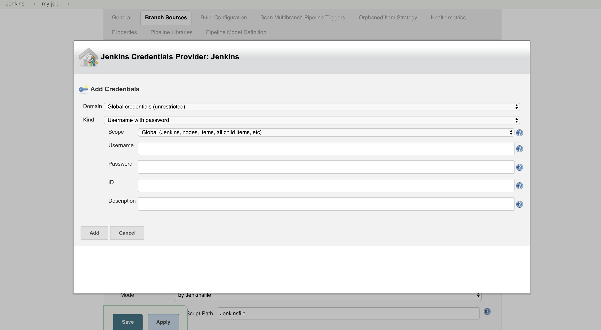
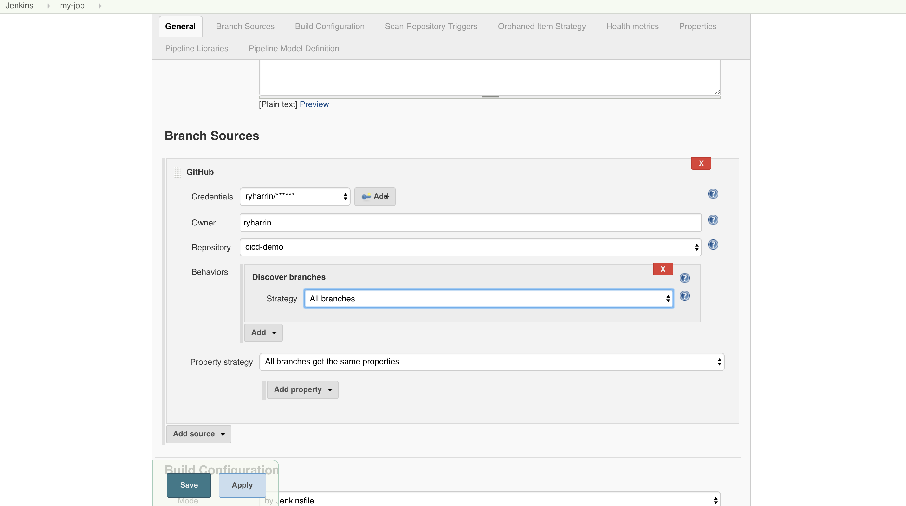
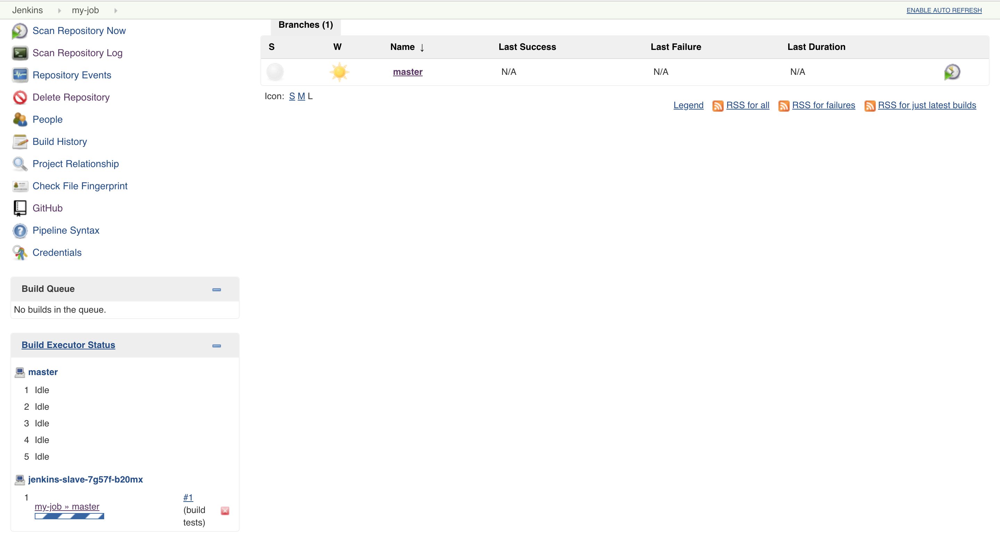
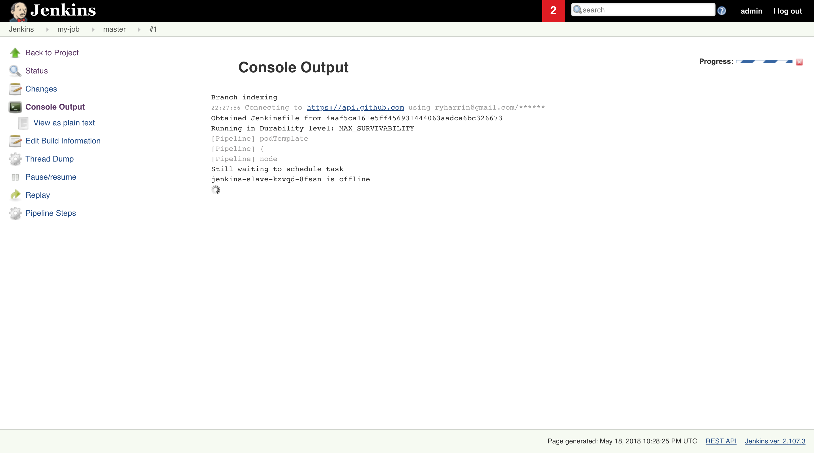

### Setup Steps

#### Requirements -
 40gb free space
 homebrew installed
+ fork repo (https://github.com/ithaka/cicd-demo), then clone and:
```
cd cicd-demo
```

### Install kubectl -
```
brew install kubectl kubernetes-helm
```
# [other oses](https://kubernetes.io/docs/tasks/tools/install-kubectl/)
###              https://docs.helm.sh/using_helm/#installing-helm

### Install minikube and virtualbox -
```
brew cask install minikube virtualbox
```
#### others oses: [Minikube](https://github.com/kubernetes/minikube/releases)
           [VirtualBox](https://www.virtualbox.org/wiki/Downloads)

#### if you already had minikube installed with other settings - minikube stop && minikube delete && rm -rf ~/.minikube
```
minikube config set disk-size 40000MB
```

### start the cluster with RBAC. This takes some time,  2-3 minutes
```
minikube start --extra-config=apiserver.Authorization.Mode=RBAC
```

### now your cluster should be running
```
eval $(minikube docker-env)
minikube status
minikube dashboard
```

### Add admin privileges to default role (not recommended in real life) -
```
kubectl create clusterrolebinding kube-system-default-superadmin \
  --clusterrole=cluster-admin \
  --serviceaccount=default:default
```

### Initialize helm
```
helm init --service-account default --tiller-namespace default
export TILLER_NAMESPACE="default"
```


should see tiller pod now
```
kubectl get pods
```

#### Install jenkins using a helm chart
```
helm repo update
helm install --name jenkins stable/jenkins --values jenkins/values.yaml --tiller-namespace=default
```
+ you can ignore most of the message that helm prints after this,

+ You may need to delete pod (not deployment) once if the dashboard shows 'pod has unbound PersistentVolumeClaims'

+ Get the url for jenkins. Username and password is admin. It might take a minute or two for
+ Jenkins to initialize and for the service to be ready.
```
minikube service jenkins --url
```

### In Jenkins
#### The following screenshots can be found the screenshots directory of this project


+ **Step 1**: you should see the login screen once you visit the url from the command above. Log in with UN: admin and PW: admin


+ **Step 2**: After logging in, you'll be presented with the Jenkins home screen. We'll want to change two settings in the main Jenkins settings, so click 'manage jenkins' then 'configure system'


+ **Step 2a**: Set the number of executors to something higher than 0, so Jenkins jobs can run. (why isn't that the default?)


+ **Step 2b**: In the Github Pull Request Builder section, click add to add a credential.
+ **Step 2b**:It will be a 'secret text.'  type credential. This needs to be a github personal access token.
  + Instructions for creating this are in the ['github-token-instructions' directory](./github-token-instructions) of this project. Hold on to this token, we'll need it again for a later step and you can't retrieve it from Github


+ **Step 3** : This screen is what you see when you click 'create new job' (or 'new item' from the menu on the left) back on the front page of Jenkins. On this screen, you'll want to enter a name for your job, then select multibranch pipeline (not pipeline or multi-configuration project) and hit ok. This will bring you to the configuration for this pipeline.


+ **Step 4a**: We need to set up a couple things in this configuration section. First click 'add source' and choose 'github'.


+ **Step 4b**: We're going to add credentials again, this time a username and password. The username will be your github username and the password will be the personal access token from step 2c

+ **Step 4c** : set the owner field to be your github username and the repository to be your forked version of this repo. Also set the 'discover branches' strategy to be all branches.


+ **Step 5** : Once you apply and save, you will be brought back to the main page for the job you created.
  + Jenkins should have indexed your branches and found that the master branch has a Jenkinsfile.
  + It should start running the pipeline in that branch. In the lower left of the screen (you might have to scroll down) you should see a jenkins slave has started and is starting to run your job.


+ **Step 6** : this is the console output of your running job. You can get here by clicking on the `#1` next to the running job mentioned in the previous step, then clicking console output. The output should eventually stop to wait for your input on this screen before continuing.

### Beyond
From here, you're on your own the explore, expand and see how this can help you automate your own actual workflows. Good luck, and we're happy to help to the extent that we can.
