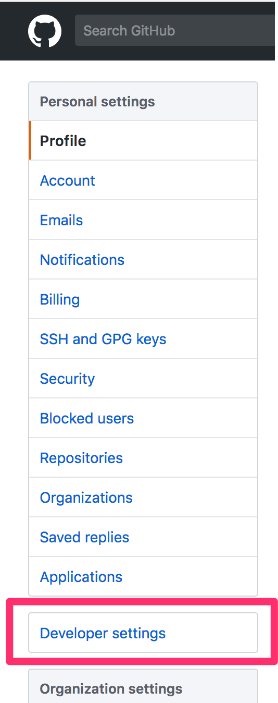
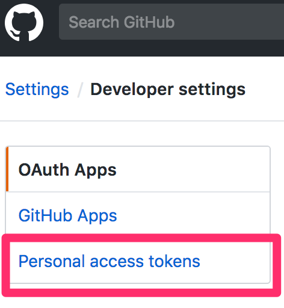
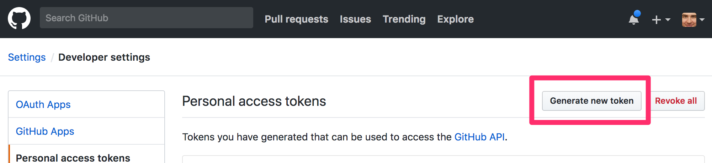

## Manually Create Personal Access tokens

### Step 1: Developer Settings

You can manually check them out here https://github.com/settings/tokens and create a new one with "repo" scope. Save it somewhere because you can't get it again (but you can delete and recreate it).

### Step 2: Personal Access Tokens

### Step 3: Generate New Token

### Step 4: Choose repo scope

