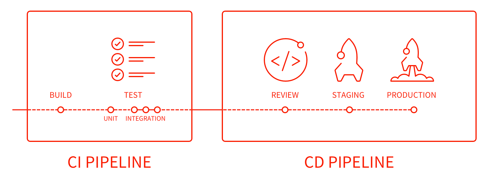
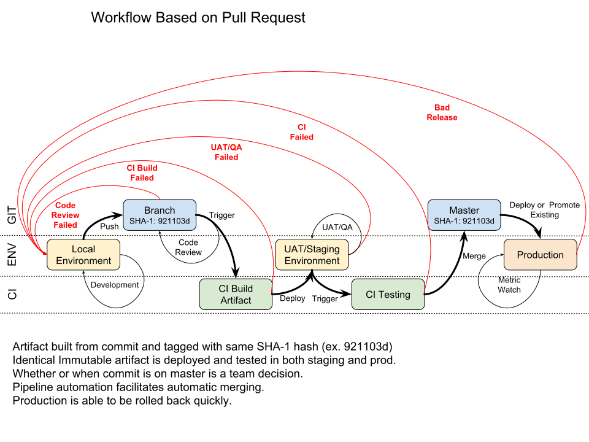
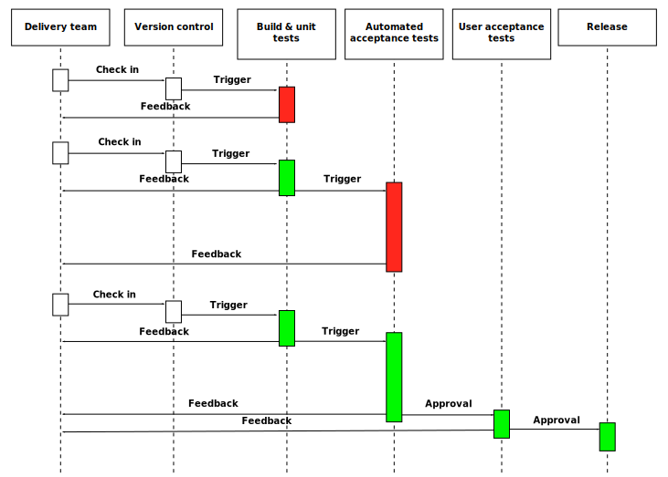
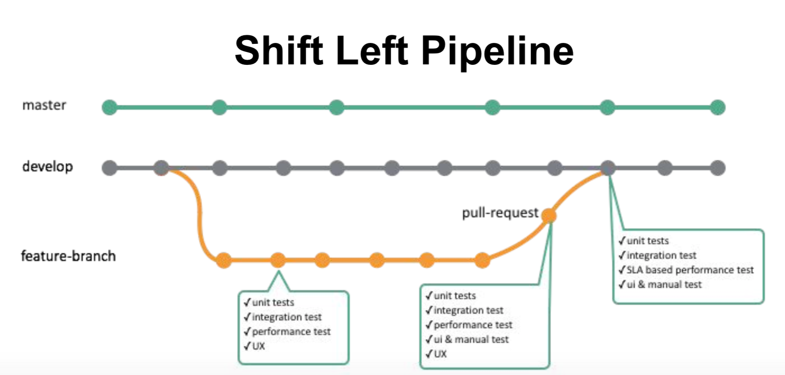

## Continuous Delivery

> More broadly the deployment pipeline's job is to detect any changes that will lead to problems in production. These can include performance, security, or usability issues. A deployment pipeline should enable collaboration between the various groups involved in delivering software and provide everyone visibility about the flow of changes in the system, together with a thorough audit trail.

> A good way to introduce continuous delivery is to model your current delivery process as a deployment pipeline, then examine this for bottlenecks, opportunities for automation, and collaboration points. From [DeploymentPipeline by Martin Fowler](https://martinfowler.com/bliki/DeploymentPipeline.html)

* From GitLab's Pipeline

* Workflow Example

From [Continuous Delivery on Wikipedia](https://en.wikipedia.org/wiki/Continuous_delivery)

### Pipeline As Code

> Teams are pushing for automation across their environments(testing), including their development infrastructure. Pipelines as code is defining the deployment pipeline through code instead of configuring a running CI/CD tool. LambdaCD, Drone, GoCD and Concourse are examples that allow usage of this technique. From [Thoughworks TechRadar](https://www.thoughtworks.com/radar/techniques/pipelines-as-code)

Jenkins approach is to have Groovy files, where most of the other players use yaml.

### Shift Left
From [Kubecon 2017 Deploying to Kubernetes Thousands of Times Per/Day - Dan Garfield, Codefresh & William Denniss, Google](https://schd.ws/hosted_files/kccncna17/2c/Kubecon%20-%20Deploying%20Thousands.pdf)

In the Typical Dev/Release Process, Staging becomes a bottleneck, so the solution is to Shift Left so earlier feedback is continuously provided on the feature branch.

### Deployment Strategies

From [k8s-deployment-strategies](https://github.com/ContainerSolutions/k8s-deployment-strategies)

#### Matrix

#### Blue/Green:

#### Canary:

### Rollback
See [How to rollout or rollback a deployment on a Kubernetes cluster?](https://romain.dorgueil.net/blog/en/tips/2016/08/27/rollout-rollback-kubernetes-deployment.html)
